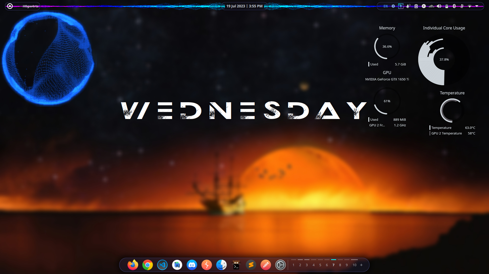

The newer version which uses image2D texture to track positions is encouraged and located here: https://github.com/Roonil/NCS_Spectrum_GLava <br/>
# NCS_Spectrum_GLava
This is an attempt to replicate the well-known NCS Spectrum Audio Reactor, implemented for GLava. This is a fragment shader comprising of 9 buffers, and may prove to be a little GPU-intensive, but looks aesthetically pleasing anyways :) 

# Installation Instructions
1. Ensure that GLava is set-up and running properly, using **THIS** render.c as source file (changes .name = "screen" to .name = "time" at line 586) to ensure that time variable works properly:
<https://github.com/jarcode-foss/glava/pull/121/commits/08a7f7c169a0a4cb72412485b2d21aff26d2c191>
2. Clone the repository and copy the 'ncs' folder into home/config/glava directory.
3. Run the module with ```glava -m ncs``` (Suggested resolution in rc.glsl: 370x370)

# Screenshots

# Shadertoy Link
The shader was first made to work on shadertoy.com, which allows developing fragment shaders. Link to the shader here: https://www.shadertoy.com/view/dtfSDM

# Credits
Credits for particle-tracking go to Rory618 on Shadertoy, see the work here: https://www.shadertoy.com/view/XddfzM
